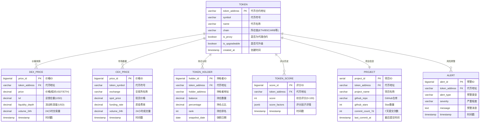

# 区块链代币分析系统 - ER图设计

## 项目概述

区块链代币分析与评分系统，用于收集、分析链上链下数据，为代币提供综合评分和投资建议。

### 核心功能
- 实时价格监控（DEX + CEX）
- 持仓分布分析
- 流动性监控和风险预警
- 代币综合评分（0-100）

## 数据源

### 链上数据
- **DEX数据**：Uniswap v2/v3、Curve等（价格、1%深度、TVL）
- **代币数据**：持仓分布、Top持仓、合约元数据
- **系统事件**：StrategySnap、ScoreUpdated、RecommendationMade

### 链下数据
- **CEX数据**：Binance、OKX等（价格、成交量、资金费率、基差）
- **开发数据**：GitHub提交记录

## ER图（简化版 - 7个核心实体）



## 核心实体说明

### 1. TOKEN（代币）- 中心实体

代币基本信息，系统的核心实体。

**关键属性：**
- `token_address`: 合约地址，主键
- `is_proxy` / `is_upgradeable`: 合约风险标识
- `chain`: 所在区块链网络

**业务规则：**
- 每个代币唯一标识
- 代理合约和可升级合约标记为高风险

**索引策略：**
```sql
CREATE INDEX idx_token_symbol ON TOKEN(symbol);
CREATE INDEX idx_token_chain ON TOKEN(chain);
CREATE INDEX idx_token_risk ON TOKEN(is_proxy, is_upgradeable)
WHERE is_proxy = true OR is_upgradeable = true;
```

---

### 2. DEX_PRICE（DEX价格快照）- 时序数据

去中心化交易所的价格和流动性数据快照。

**关键属性：**
- `price`: 代币价格（相对USDT或ETH）
- `tvl`: 总锁仓量
- `liquidity_depth`: 流动性深度（1%价格影响）
- `volume_24h`: 24小时交易量

**业务规则：**
- 高频更新（1-5分钟一次）
- 按月分区存储
- 保留6个月数据

**分区策略：**
```sql
CREATE TABLE DEX_PRICE (
    price_id BIGSERIAL,
    token_address VARCHAR(42) NOT NULL,
    price DECIMAL(36, 18) NOT NULL,
    tvl DECIMAL(36, 2),
    liquidity_depth DECIMAL(36, 2),
    volume_24h DECIMAL(36, 2),
    timestamp TIMESTAMP NOT NULL,
    PRIMARY KEY (price_id, timestamp)
) PARTITION BY RANGE (timestamp);

-- 按月创建分区
CREATE TABLE DEX_PRICE_2025_01 PARTITION OF DEX_PRICE
FOR VALUES FROM ('2025-01-01') TO ('2025-02-01');
```

**索引策略：**
```sql
CREATE INDEX idx_dex_token_time ON DEX_PRICE(token_address, timestamp DESC);
CREATE INDEX idx_dex_time ON DEX_PRICE(timestamp DESC);
```

**典型查询：**
```sql
-- 获取某代币最近24小时价格走势
SELECT timestamp, price, tvl
FROM DEX_PRICE
WHERE token_address = '0x...'
  AND timestamp > NOW() - INTERVAL '24 hours'
ORDER BY timestamp;
```

---

### 3. CEX_PRICE（CEX市场数据）- 时序数据

中心化交易所的市场数据。

**关键属性：**
- `spot_price`: 现货价格
- `funding_rate`: 永续合约资金费率（市场情绪指标）
- `exchange`: 交易所名称（Binance, OKX等）

**业务规则：**
- 高频更新（每分钟）
- 按月分区
- 资金费率正值表示多头占优，负值表示空头占优

**索引策略：**
```sql
CREATE INDEX idx_cex_symbol_time ON CEX_PRICE(token_symbol, timestamp DESC);
CREATE INDEX idx_cex_exchange ON CEX_PRICE(exchange);
```

**典型查询：**
```sql
-- 获取某代币在各CEX的最新价格和资金费率
SELECT exchange, spot_price, funding_rate
FROM CEX_PRICE
WHERE token_symbol = 'ETH'
  AND timestamp > NOW() - INTERVAL '5 minutes'
ORDER BY timestamp DESC;
```

---

### 4. TOKEN_HOLDER（代币持有者）- 快照数据

代币持仓分布数据，用于分析筹码集中度。

**关键属性：**
- `holder_address`: 持有者地址
- `balance`: 持仓数量
- `percentage`: 持仓占比
- `rank`: 持仓排名（Top 1, Top 2, ...）

**业务规则：**
- 每日快照一次
- 关注Top 10/20持仓变化
- 高集中度（Top 10 > 50%）标记为高风险

**索引策略：**
```sql
CREATE INDEX idx_holder_token_date ON TOKEN_HOLDER(token_address, snapshot_date DESC);
CREATE INDEX idx_holder_rank ON TOKEN_HOLDER(token_address, rank) WHERE rank <= 10;
```

**典型查询：**
```sql
-- 获取某代币Top 10持仓地址
SELECT holder_address, balance, percentage
FROM TOKEN_HOLDER
WHERE token_address = '0x...'
  AND snapshot_date = CURRENT_DATE
ORDER BY rank
LIMIT 10;

-- 计算Top 10集中度
SELECT
    token_address,
    SUM(percentage) as top10_concentration
FROM TOKEN_HOLDER
WHERE snapshot_date = CURRENT_DATE
  AND rank <= 10
GROUP BY token_address
HAVING SUM(percentage) > 50;
```

---

### 5. TOKEN_SCORE（代币评分）- 事件数据

系统对代币的综合评分。

**关键属性：**
- `score`: 综合评分（0-100）
- `score_factors`: 评分因子（JSON格式）
  ```json
  {
    "liquidity_score": 85,
    "holder_distribution_score": 70,
    "dev_activity_score": 90,
    "market_sentiment_score": 75
  }
  ```

**业务规则：**
- 评分变化时记录
- 分数 < 40 触发风险预警
- 评分每小时更新一次

**索引策略：**
```sql
CREATE INDEX idx_score_token_time ON TOKEN_SCORE(token_address, timestamp DESC);
CREATE INDEX idx_score_value ON TOKEN_SCORE(score DESC);
```

**典型查询：**
```sql
-- 获取某代币最新评分
SELECT score, score_factors
FROM TOKEN_SCORE
WHERE token_address = '0x...'
ORDER BY timestamp DESC
LIMIT 1;

-- Top 10高评分代币
SELECT t.symbol, s.score
FROM TOKEN t
JOIN LATERAL (
    SELECT score
    FROM TOKEN_SCORE
    WHERE token_address = t.token_address
    ORDER BY timestamp DESC
    LIMIT 1
) s ON true
ORDER BY s.score DESC
LIMIT 10;
```

---

### 6. PROJECT（项目信息）- 静态数据

代币对应的项目信息。

**关键属性：**
- `github_repo`: GitHub仓库地址
- `github_stars`: Star数量
- `commit_count_7d`: 近7天提交次数
- `last_commit_at`: 最后提交时间

**业务规则：**
- 一个代币对应一个项目
- 超过30天无提交标记为停滞风险
- GitHub数据每日更新

**索引策略：**
```sql
CREATE INDEX idx_project_token ON PROJECT(token_address);
CREATE INDEX idx_project_stars ON PROJECT(github_stars DESC);
```

**典型查询：**
```sql
-- 获取开发最活跃的项目
SELECT p.project_name, t.symbol, p.commit_count_7d, p.last_commit_at
FROM PROJECT p
JOIN TOKEN t ON p.token_address = t.token_address
WHERE p.commit_count_7d > 10
ORDER BY p.commit_count_7d DESC
LIMIT 20;
```

---

### 7. ALERT（预警记录）- 事件数据

风险预警记录。

**关键属性：**
- `alert_type`: 预警类型
  - LIQUIDITY_DROP: 流动性枯竭
  - PRICE_SPIKE: 价格异动
  - WHALE_MOVEMENT: 巨鲸异动
  - RUG_PULL_RISK: 跑路风险
- `severity`: 严重程度（LOW, MEDIUM, HIGH, CRITICAL）

**业务规则：**
- 触发条件时自动创建
- HIGH和CRITICAL级别发送通知
- 保留30天记录

**索引策略：**
```sql
CREATE INDEX idx_alert_token_time ON ALERT(token_address, timestamp DESC);
CREATE INDEX idx_alert_severity ON ALERT(severity, timestamp DESC)
WHERE severity IN ('HIGH', 'CRITICAL');
```

**典型查询：**
```sql
-- 获取某代币的高危预警
SELECT alert_type, severity, message, timestamp
FROM ALERT
WHERE token_address = '0x...'
  AND severity IN ('HIGH', 'CRITICAL')
ORDER BY timestamp DESC
LIMIT 10;
```

---

## 关系说明

### 一对多关系

所有实体都以 **TOKEN 为中心**：

1. **TOKEN → DEX_PRICE** (1:N)
   - 一个代币有多个价格快照
   - 外键：`DEX_PRICE.token_address → TOKEN.token_address`

2. **TOKEN → CEX_PRICE** (1:N)
   - 通过 `token_symbol` 关联（软关联）

3. **TOKEN → TOKEN_HOLDER** (1:N)
   - 一个代币有多个持仓者
   - 外键：`TOKEN_HOLDER.token_address → TOKEN.token_address`

4. **TOKEN → TOKEN_SCORE** (1:N)
   - 一个代币有多个历史评分
   - 外键：`TOKEN_SCORE.token_address → TOKEN.token_address`

5. **TOKEN → ALERT** (1:N)
   - 一个代币有多个预警记录
   - 外键：`ALERT.token_address → TOKEN.token_address`

### 一对一关系

6. **TOKEN → PROJECT** (1:1)
   - 一个代币对应一个项目
   - 外键：`PROJECT.token_address → TOKEN.token_address` (UNIQUE)

---

## 数据库视图

### v_token_dashboard（代币综合仪表盘）

```sql
CREATE OR REPLACE VIEW v_token_dashboard AS
SELECT
    t.token_address,
    t.symbol,
    t.name,
    t.is_proxy,
    t.is_upgradeable,
    -- 最新DEX价格
    (SELECT price FROM DEX_PRICE
     WHERE token_address = t.token_address
     ORDER BY timestamp DESC LIMIT 1) as latest_dex_price,
    -- 最新TVL
    (SELECT tvl FROM DEX_PRICE
     WHERE token_address = t.token_address
     ORDER BY timestamp DESC LIMIT 1) as tvl,
    -- 最新评分
    (SELECT score FROM TOKEN_SCORE
     WHERE token_address = t.token_address
     ORDER BY timestamp DESC LIMIT 1) as latest_score,
    -- 项目信息
    p.github_stars,
    p.commit_count_7d
FROM TOKEN t
LEFT JOIN PROJECT p ON t.token_address = p.token_address;
```

---

## 索引策略总结

### 主键索引（自动创建）
- TOKEN(token_address)
- DEX_PRICE(price_id, timestamp)
- CEX_PRICE(price_id, timestamp)
- TOKEN_HOLDER(holder_id)
- TOKEN_SCORE(score_id)
- PROJECT(project_id)
- ALERT(alert_id)

### 二级索引（手动创建）

**高频查询优化：**
```sql
-- 代币符号查询
CREATE INDEX idx_token_symbol ON TOKEN(symbol);

-- 时序数据范围查询
CREATE INDEX idx_dex_token_time ON DEX_PRICE(token_address, timestamp DESC);
CREATE INDEX idx_cex_symbol_time ON CEX_PRICE(token_symbol, timestamp DESC);

-- 评分排序
CREATE INDEX idx_score_value ON TOKEN_SCORE(score DESC);

-- 持仓排名查询
CREATE INDEX idx_holder_rank ON TOKEN_HOLDER(token_address, rank) WHERE rank <= 10;

-- 高危预警查询
CREATE INDEX idx_alert_severity ON ALERT(severity, timestamp DESC)
WHERE severity IN ('HIGH', 'CRITICAL');
```

---

## 典型业务场景查询

### 场景1: 代币综合仪表盘

```sql
SELECT * FROM v_token_dashboard WHERE symbol = 'ETH';
```

### 场景2: 流动性监控

```sql
-- 检测TVL异常下降
WITH current_tvl AS (
    SELECT token_address, SUM(tvl) as tvl
    FROM DEX_PRICE
    WHERE timestamp > NOW() - INTERVAL '1 hour'
    GROUP BY token_address
),
previous_tvl AS (
    SELECT token_address, SUM(tvl) as tvl
    FROM DEX_PRICE
    WHERE timestamp BETWEEN NOW() - INTERVAL '25 hours'
                        AND NOW() - INTERVAL '24 hours'
    GROUP BY token_address
)
SELECT
    t.symbol,
    c.tvl as current_tvl,
    p.tvl as previous_tvl,
    (c.tvl - p.tvl) / p.tvl * 100 as tvl_change_pct
FROM TOKEN t
JOIN current_tvl c ON t.token_address = c.token_address
JOIN previous_tvl p ON t.token_address = p.token_address
WHERE (c.tvl - p.tvl) / p.tvl < -0.2  -- 下降超过20%
ORDER BY tvl_change_pct;
```

### 场景3: CEX-DEX套利机会

```sql
SELECT
    t.symbol,
    d.price as dex_price,
    c.spot_price as cex_price,
    (c.spot_price - d.price) / d.price * 100 as price_diff_pct,
    d.liquidity_depth
FROM TOKEN t
JOIN (
    SELECT token_address, price, liquidity_depth
    FROM DEX_PRICE
    WHERE timestamp > NOW() - INTERVAL '5 minutes'
    ORDER BY timestamp DESC
    LIMIT 1
) d ON t.token_address = d.token_address
JOIN (
    SELECT token_symbol, spot_price
    FROM CEX_PRICE
    WHERE timestamp > NOW() - INTERVAL '5 minutes'
    ORDER BY timestamp DESC
    LIMIT 1
) c ON t.symbol = c.token_symbol
WHERE ABS((c.spot_price - d.price) / d.price) > 0.02  -- 价差超过2%
  AND d.liquidity_depth > 100000  -- 流动性充足
ORDER BY ABS((c.spot_price - d.price) / d.price) DESC;
```

### 场景4: 巨鲸监控

```sql
-- 检测Top持仓地址的大额变动
WITH latest_snapshot AS (
    SELECT MAX(snapshot_date) as latest_date
    FROM TOKEN_HOLDER
    WHERE token_address = '0x...'
),
previous_snapshot AS (
    SELECT MAX(snapshot_date) as previous_date
    FROM TOKEN_HOLDER
    WHERE token_address = '0x...'
      AND snapshot_date < (SELECT latest_date FROM latest_snapshot)
)
SELECT
    l.holder_address,
    l.balance as current_balance,
    p.balance as previous_balance,
    (l.balance - p.balance) as balance_change,
    (l.balance - p.balance) / p.balance * 100 as change_pct
FROM TOKEN_HOLDER l
JOIN TOKEN_HOLDER p ON l.holder_address = p.holder_address
WHERE l.token_address = '0x...'
  AND l.snapshot_date = (SELECT latest_date FROM latest_snapshot)
  AND p.snapshot_date = (SELECT previous_date FROM previous_snapshot)
  AND ABS((l.balance - p.balance) / p.balance) > 0.1  -- 变化超过10%
ORDER BY ABS(balance_change) DESC;
```

---

## 数据保留策略

### 时序数据归档

```sql
-- 归档6个月前的DEX价格数据
CREATE TABLE DEX_PRICE_ARCHIVE (LIKE DEX_PRICE INCLUDING ALL);

INSERT INTO DEX_PRICE_ARCHIVE
SELECT * FROM DEX_PRICE
WHERE timestamp < NOW() - INTERVAL '6 months';

DELETE FROM DEX_PRICE
WHERE timestamp < NOW() - INTERVAL '6 months';
```

### 聚合历史数据

```sql
-- 将分钟级数据聚合为小时级
CREATE TABLE DEX_PRICE_HOURLY AS
SELECT
    token_address,
    DATE_TRUNC('hour', timestamp) as hour,
    AVG(price) as avg_price,
    MIN(price) as min_price,
    MAX(price) as max_price,
    AVG(tvl) as avg_tvl,
    SUM(volume_24h) as total_volume
FROM DEX_PRICE
WHERE timestamp < NOW() - INTERVAL '30 days'
GROUP BY token_address, DATE_TRUNC('hour', timestamp);
```

---

## 性能优化建议

### 1. 分区表优化

```sql
-- 自动创建分区（使用pg_partman扩展）
CREATE EXTENSION pg_partman;

SELECT partman.create_parent(
    'public.dex_price',
    'timestamp',
    'native',
    'monthly'
);
```

### 2. 查询优化

```sql
-- 使用EXPLAIN分析查询计划
EXPLAIN (ANALYZE, BUFFERS)
SELECT * FROM v_token_dashboard WHERE symbol = 'ETH';

-- 更新表统计信息
ANALYZE TOKEN;
ANALYZE DEX_PRICE;
```

### 3. 连接池配置

```javascript
// Node.js pg连接池
const pool = new Pool({
  max: 20,  // 最大连接数
  idleTimeoutMillis: 30000,
  connectionTimeoutMillis: 2000,
});
```

---

## 扩展方向

### 可选扩展实体

1. **TRANSACTION_HISTORY**（交易历史）
   - 记录链上交易详情
   - 用于更深入的链上分析

2. **USER_WATCHLIST**（用户关注列表）
   - 用户可以关注特定代币
   - 个性化推荐

3. **MARKET_INDICATOR**（市场指标）
   - 全市场的宏观指标
   - 辅助投资决策

### 可选功能优化

1. **实时计算引擎**
   - 使用Apache Flink处理流式数据
   - 实时更新评分和预警

2. **机器学习模型**
   - 价格预测模型
   - 风险评估模型

3. **全文搜索**
   - 为新闻和项目描述添加全文索引
   - 快速搜索相关代币

---

## 总结

此ER图设计了**7个核心实体**，涵盖：

✅ **链上数据**
- DEX价格、流动性、TVL（DEX_PRICE）
- 代币持仓分布（TOKEN_HOLDER）
- 合约风险标识（TOKEN）

✅ **链下数据**
- CEX市场数据（CEX_PRICE）
- 开发活跃度（PROJECT）

✅ **系统数据**
- 评分系统（TOKEN_SCORE）
- 风险预警（ALERT）

✅ **核心特性**
- 以TOKEN为中心的星型结构
- 时序数据分区优化
- 完整的索引策略
- 实用的业务查询示例

该设计简洁高效，适合快速开发和部署。
